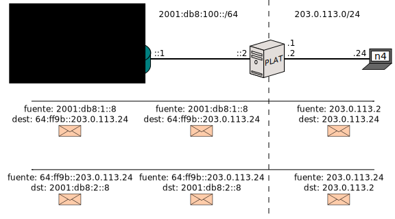
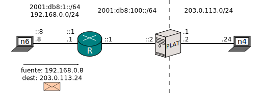
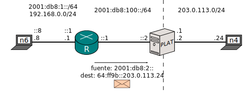
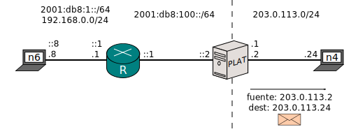

[Documentación](esp-doc-index.html) > [Ejemplos de uso](esp-doc-index.html#ejemplos-de-uso) > 464XLAT

# 464XLAT

## Índice

1. [Introducción](#introduccion)
2. [Red de ejemplo](#red-de-ejemplo)
3. [Flujo de paquetes esperado](#flujo-de-paquetes-esperado)
4. [Pruebas](#pruebas)
5. [Palabras de cierre](#palabras-de-cierre)
6. [Lecturas adicionales](#lecturas-adicionales)

## Introduction

NAT64 no es perfecto. Aunque puedas ver mucho trafico ser tradicido sin capricho alguno, quizá puedas llegar eventualmente al siguiente comportamiento inesperado.

Salvo el RFC 6384, NAT64 solo traduce cabeceras de red (IPv4, IPv6 y ICMP) y cabeceras de transporte (UDP y TCP). Algunas veces, esto es un problema. Algunos protocolos que trabajan encima de UDP y TCP tienen el mal hábito de incluir direcciones IP ("Valores IP literales") a lo largo de sus conversaciones; ya que NAT64 solo traduce protocolos de mas abajo, estos valores pasaran por el NAT64 sin ser modificados.

Por ejemplo, algunos sitios que no toman en cuenta IPv6, los cuales normalmente contendrian este HTML:
 
 <a href="www.jool.mx/index.html">Enlace a algo.</a>
 
 Podrian ser pobremente codificados de esta manera:

 <a href="203.0.113.24/index.html">Enlace a algo.</a>

Esta dirección está dentro del cuerpo de un archivo HTML, no de una cabecera de transporte de red. No es viable para Jool soportar la traduccion de todos los protocolos de aplicación existentes.

Si le das click a la segunda versión del enlace mostrado en la parte de arriba desde un nodo que solo soporta IPv6 y tratas de utilizar el NAT64, es obvio que no funcionará, por que el nodo no tiene una pila IPv4 con cual accesar a `203.0.113.24`.  `www.jool.mx` funciona bien por que el DNS64 adjunta el frefijo NAT64 una vez que el nodo pregunta por el dominio; por otra parte, si todo lo que el nodo tiene es `203.0.113.24`, realmente no puede decir que esta hablando mediante un NAT64, mucho menos saber que prefijo deberia ser añadido.

[464XLAT](https://tools.ietf.org/html/rfc6877) es una técnica orientada a solucionar esta limitante. Funciona agregando un SIIT a la ecuación, que revierte el trabajo hecho por el Stateful NAT64. La idea puede ser generalizada para tambien proveer Internet a servicios que solo soportan IPv4 cuando todo lo que tienes es un espacio de direcciones IPv6, la cual es un [Modo de traducción dual SIIT/DC](https://tools.ietf.org/html/draft-ietf-v6ops-siit-dc-2xlat-00)

Este documento es un resumen simplificado de ambas técnicas, colapsado en una introducción que usa Jool.

## Red de ejemplo

La caja roja seria tu dominio. _n6_ respresenta un "nodo IPv6" y _R_ es un "router". Digamos que tu proveedor de internet solo te proporciona direcciones IPv6, pero tambien te garantiza acceso a IPv4 mediante un stateful NAT64(_PLAT_; Traductor del lado del proveedor o "Provider-side Translator" por sus siglas en inglés). _n4_ nodo de Internet IPv4 aleatorio.

Digamos que tu usuario de _n6_ hace click a un enlace hacia `203.0.113.24`. _n6_ no tiene una pila IPv4, asi que la solicitud no tiene a donde ir. La situación puede ser enmendada agregando el prefijo NAT64 a la direccion, pero el usuario no lo sabe. Por supuesto, un DNS64 seria la solución ideal y transparente, pero desafortunadamente el sitio proporcionó una dirección y no un nombre de dominio, asi que _n6_ no le esta enviando ninguna solicitud al DNS.

Alternativamente, _n6_ quizá quiera proveer un servicio legado(o cliente) el cual esta desafortunadamente ligado a IPv4. Ya que _n6_ solo tiene direcciones IPv6 globales, aparentemente no puede hacerlo.

En terminos amplios, la solución es proporcionar a _n6_ una pila IPv4 "falsa" cuyos paquetes serán traducidos a IPv6 antes de llegar al _PLAT_. En
otras palabras, un servicio SIIT (en terminos 464XLAT llamado "_CLAT_"; Traductod del lado del cliente o "Customer-side Translator" por sus siglas en inglés) estará, de cierta forma, deshaciendo el trabajo del _PLAT_.  

Hay muchas maneras de hacer esto. Desafortunadamente, una de ellas ([volver _n6_ el CLAT](https://tools.ietf.org/html/draft-ietf-v6ops-siit-dc-2xlat-00#section-3.1)) todavia no se encuentra implementada en Jool. Una que funcion es hacer que _R_ sea el CLAT. La red luciría como esto: 

Tambien removi las nubes para simplificar el ruteo en el ejemplo. La idea de la traduccion realmente no tiene nada que ver con el ruteo, asi que esto no es importante.

## Flujo de paquetes esperado

Este es el flujo normal que un paquete de origen IPv6 atravesaría. Es un flujo sateful NAT64 típico y la traducción dual presentada en esta configuración no interferirá con el: Toma en curnta que hemos elejido 64:ff9b::/96 como prefijo NAT64 del _PLAT_:

El flujo 464XLAT que queremos lograr es el siguiente. _n6_ utilizará su dirección IPv4 para intentar consultar el valor literal (o cualquier dirección de internet IPv4):

_R_ 

_R_ will SIIT the packet into IPv6 so it can traverse the IPv6-only chunk. Address 192.168.0.8 will be translated using the EAMT, and 203.0.113.24 will receive the `pool6` prefix treatment to mirror _PLAT_'s.

_PLAT_ hará su magia y mandará el paquete a la internet IPv4:

Y la modificación será espejeada para la respuesta:

## Configuración

_n6_ no sabe que de alguna forma es dueño de otra dirección IPv6 en la red 2001:db8:2::/96. Nunca ve el trafico,  por que _R_ siempre siempre lo traduce hacia 192.0.2.0/24.

	service network-manager stop

	ip link set eth0 up
	ip addr add 2001:db8:1::8/64 dev eth0
	ip addr add 192.168.0.8/24 dev eth0

	ip route add default via 2001:db8:1::1
	ip route add default via 192.168.0.1

Esto es _R_:

	service network-manager stop

	ip link set eth0 up
	ip addr add 192.168.0.1/24 dev eth0
	ip addr add 2001:db8:1::1/64 dev eth0

	ip link set eth1 up
	ip addr add 2001:db8:100::1/64 dev eth1

	# Traffic headed to the real IPv4 Internet goes via PLAT.
	ip route add 64:ff9b::/96 via 2001:db8:100::2

	# Enable routerness.
	sysctl -w net.ipv6.conf.all.forwarding=1
	sysctl -w net.ipv4.conf.all.forwarding=1

	# Enable SIIT.
	# We're masking the private network using an EAMT entry.
	# Traffic towards the Internet is to be appended PLAT's prefix.
	# Recall that the EAMT has higher precedence than the prefix.
	modprobe jool_siit pool6=64:ff9b::/96
	jool_siit --eamt --add 192.168.0.8/29 2001:db8:2::/125

El paquete de _n6_ tendra la dirección `192.168.0.8` y `203.0.113.24`. La primera será traducida utilizando el registro EAMT ( ya que coincide con `192.168.0.8/29`) y la segunda utilizará el prefijo `pool6` (por que no coincide).

Tambien toma en cuenta que _R_ es una implementacion aproximada de SIIT y jamas se debe de pensar en esta instalación de Jool como nada mas que eso.

Para efectos de ilustrar completamente, mostramos la configuracion de red de _PLAT_:

	service network-manager stop

	ip link set eth0 up
	ip addr add 2001:db8:100::2/64 dev eth0
	# I'm pretending the ISP gave us these two prefixes to play with.
	ip route add 2001:db8:1::/64 via 2001:db8:100::1
	ip route add 2001:db8:2::/64 via 2001:db8:100::1

	ip link set eth1 up
	ip addr add 203.0.113.1/24 dev eth1
	ip addr add 203.0.113.2/24 dev eth1

	modprobe jool pool6=64:ff9b::/96 pool4=203.0.113.2

Y _n4_ es profundamente aburrido:

	service network-manager stop

	ip link set eth0 up
	ip addr add 203.0.113.24/24 dev eth0
	ip route add default via 203.0.113.2

## Pruebas

Haz un ping a _n4_ mediante IPv4 desde _n6_:

	$ ping 203.0.113.24 -c 1
	PING 203.0.113.24 (203.0.113.24) 56(84) bytes of data.
	64 bytes from 203.0.113.24: icmp_seq=1 ttl=62 time=4.13 ms

	--- 203.0.113.24 ping statistics ---
	1 packets transmitted, 1 received, 0% packet loss, time 0ms
	rtt min/avg/max/mdev = 4.130/4.130/4.130/0.000 ms

- [ipv4-n6.pcapng](obj/464xlat/ipv4-n6.pcapng)
- [ipv4-r.pcapng](obj/464xlat/ipv4-r.pcapng)
- [ipv4-plat.pcapng](obj/464xlat/ipv4-plat.pcapng)
- [ipv4-n4.pcapng](obj/464xlat/ipv4-n4.pcapng)

HAz un ping a _n4_ mediante IPv6 desde _n6_:

	$ ping6 64:ff9b::203.0.113.24 -c 1
	PING 64:ff9b::203.0.113.24(64:ff9b::cb00:7118) 56 data bytes
	64 bytes from 64:ff9b::cb00:7118: icmp_seq=1 ttl=62 time=14.0 ms

	--- 64:ff9b::203.0.113.24 ping statistics ---
	1 packets transmitted, 1 received, 0% packet loss, time 0ms
	rtt min/avg/max/mdev = 14.053/14.053/14.053/0.000 ms

- [ipv6-n6.pcapng](obj/464xlat/ipv6-n6.pcapng)
- [ipv6-r.pcapng](obj/464xlat/ipv6-r.pcapng)
- [ipv6-plat.pcapng](obj/464xlat/ipv6-plat.pcapng)
- [ipv6-n4.pcapng](obj/464xlat/ipv6-n4.pcapng)

## Palabras de cierre

Aunque en este punto puedes ver como puedes defenderte de los valores IP literales y applicaciones legadas que solo soportan IPv4, quizá quieras ser advertido previamente de que al menos un [protocolo de aplicación](http://tools.ietf.org/html/rfc959) allá afuera esta tan pobremente diseñado que trabaja diferente dependiendo de si esta trabajando sobre IPv6 o IPv4. Como resultado, []

Though at this point you can see how you can defend yourself against IP literals and legacy IPv4-only appliances, you might want to be forewarned that at least [one application protocol](http://tools.ietf.org/html/rfc959) out there is so poorly designed it works differently depending on whether it's sitting on top of IPv6 or IPv4. Therefore, [addressing IP literals in this case is not sufficient to make FTP work via NAT64](https://github.com/NICMx/NAT64/issues/114).

Por otra parte, algunos protocolos solo dependen parcialmente de valores literales, y el NAT64 no va a entrometerse en el camino de los que no. El modo pasivo de FTP cae en esta categoria. 

On the other hand, some network-aware protocols only partially depend on literals, and the NAT64 is not going to get in the way of the features that don't. FTP's passive mode falls in this category.

You can make active FTP work by deploying a fully stateless dual translation environment such as [siit-dc-2xlat](https://tools.ietf.org/html/draft-ietf-v6ops-siit-dc-2xlat-00). It works because both the client and server are both using IPv4 sockets, the IPv4 addresses are unchanged end-to-end, and it's fully bi-directional, so active and passive FTP on arbitrary ports work fine. In siit-dc-2xlat, the IPv6 network in the middle becomes an invisible "tunnel" through which IPv4 is transported.

Here's a list of protocols that are known to use IP literals. You might also want to see [RFC 6586](http://tools.ietf.org/html/rfc6586).

 - FTP
 - Skype
 - NFS
 - Google Talk Client
 - AIM (AOL)
 - ICQ (AOL)
 - MSN
 - Webex
 - [Some games](http://tools.ietf.org/html/rfc6586#section-5.4)
 - [Spotify](http://tools.ietf.org/html/rfc6586#section-5.5)
 - [Poorly coded HTML](http://tools.ietf.org/html/rfc6586#section-6.1)

## Lecturas adicionales

- [464XLAT](https://tools.ietf.org/html/rfc6877)
- [SIIT/DC: Dual Translation Mode](https://tools.ietf.org/html/draft-ietf-v6ops-siit-dc-2xlat-00)
