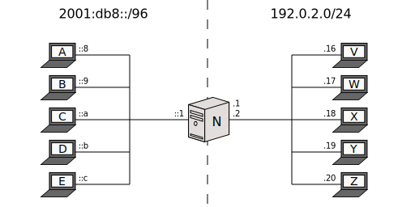

# [Doc](doc-index.html) > [Kernel Module](doc-index.html#kernel-module) > Basic Runs

## Index

1. [Introduction](#introduction)
2. [Sample Network](#sample-network)
3. [Jool](#jool)
4. [Testing](#testing)
5. [Further reading](#further-reading)

## Introduction

This document explains how to run Jool in [stateful mode](intro-nat64.html#stateful-nat64).

Software-wise, only a [successful install of the kernel module](mod-install.html) is required. The userspace application is not needed in this basic run.

## Sample Network

All the remarks in the first document's [Sample Network section](mod-run-vanilla.html#sample-network) apply here.

Nodes _A_ through _E_:


user@A:~# service network-manager stop
user@A:~# /sbin/ip address add 2001:db8::5/96 dev eth0
user@A:~# /sbin/ip route add default via 2001:db8::1 dev eth0


Nodes _V_ through _Z_:


user@V:~# service network-manager stop
user@V:~# /sbin/ip address add 192.0.2.5/24 dev eth0
user@V:~# /sbin/ip route add default via 192.0.2.2 dev eth0


Node _N_:


user@N:~# service network-manager stop
user@N:~# /sbin/ip address add 2001:db8::1/96 dev eth0
user@N:~# /sbin/ip address add 192.0.2.1/24 dev eth1
user@N:~# sysctl -w net.ipv4.conf.all.forwarding=1
user@N:~# sysctl -w net.ipv6.conf.all.forwarding=1
user@N:~# ethtool --offload eth0 tso off
user@N:~# ethtool --offload eth0 ufo off
user@N:~# ethtool --offload eth0 gso off
user@N:~# ethtool --offload eth0 gro off
user@N:~# ethtool --offload eth0 lro off
user@N:~# ethtool --offload eth1 tso off
user@N:~# ethtool --offload eth1 ufo off
user@N:~# ethtool --offload eth1 gso off
user@N:~# ethtool --offload eth1 gro off
user@N:~# ethtool --offload eth1 lro off


Remember you might want to cross-ping _N_ vs everything before continuing.

## Jool


user@N:~# /sbin/modprobe jool_stateful pool6=2001:db8::/96 pool4=192.0.2.2


`pool6` and `pool4` have the same meaning as in stateless Jool, EAM is not available on stateful mode.

## Testing

If something doesn't work, try the [FAQ](misc-faq.html).


user@C:~$ ping6 64:ff9b::192.0.2.2
PING 64:ff9b::192.0.2.2(64:ff9b::c000:202) 56 data bytes
64 bytes from 64:ff9b::c000:202: icmp_seq=1 ttl=63 time=3.66 ms
64 bytes from 64:ff9b::c000:202: icmp_seq=2 ttl=63 time=2.53 ms
64 bytes from 64:ff9b::c000:202: icmp_seq=3 ttl=63 time=3.28 ms
64 bytes from 64:ff9b::c000:202: icmp_seq=4 ttl=63 time=2.49 ms
^C
--- 64:ff9b::192.0.2.2 ping statistics ---
4 packets transmitted, 4 received, 0% packet loss, time 3008ms
rtt min/avg/max/mdev = 2.498/2.996/3.666/0.497 ms


## Further Reading

1. An IPv4 "outside" node cannot start communication because it "sees" the IPv6 network as an IPv4 private network behind a NAT. To remedy this, Jool enables you to configure "port forwarding". See [here](op-static-bindings.html) if you're interested.
2. There's a discussion on the [IPv4 pool](op-pool4.html).
3. The [DNS64 document](op-dns64.html) will tell you how to make the prefix-address-hack transparent to users.

