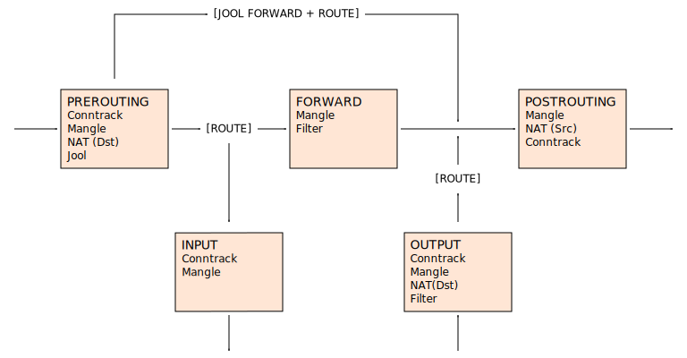
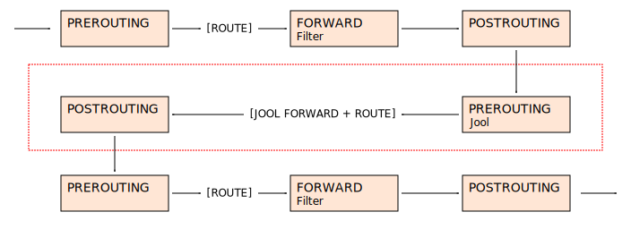

[Documentation](documentation.html) > [Introduction](documentation.html#introduction) > What is Jool?

# Introduction to Jool

## Index

1. [Overview](#overview)
2. [Compliance](#compliance)
3. [Compatibility](#compatibility)
4. [Design](#design)

## Overview

Jool is an Open Source implementation of [IPv4/IPv6 Translation](intro-xlat.html) on Linux. Until version 3.2.x, it used to be only a Stateful NAT64; starting from 3.3.0, it also supports SIIT mode.

## Compliance

As far as we know, this is the compliance status of Jool 3.4:

| RFC/draft | Reminder name | Status |
|-----------|---------|--------|
| [RFC 6052](https://tools.ietf.org/html/rfc6052) | IP address translation | Fully compliant. |
| [RFC 6144](https://tools.ietf.org/html/rfc6144) | IPv4/IPv6 Translation Framework | Fully compliant. |
| [RFC 7915](https://tools.ietf.org/html/rfc7915) | SIIT | Fully compliant. |
| [RFC 6146](https://tools.ietf.org/html/rfc6146) | Stateful NAT64 | Fully compliant. |
| [RFC 6384](http://tools.ietf.org/html/rfc6384) | FTP over NAT64 | [Not yet compliant]({{ site.repository-url }}/issues/114). |
| [RFC 6791](https://tools.ietf.org/html/rfc6791) | ICMP quirks | In short, this RFC wants two things: A pool of IPv4 addresses and an ICMP header extension. Jool implements the former but not the latter. |
| [RFC 6877](http://tools.ietf.org/html/rfc6877) | 464XLAT | Rather implemented as SIIT-DC-DTM; see below. |
| [RFC 7755]({{ site.draft-siit-dc }}) | SIIT-DC | Fully compliant. |
| [RFC 7756]({{ site.draft-siit-dc-2xlat }}) | SIIT-DC: Dual Translation Mode | Fully compliant. |
| [RFC 8021]({{ site.draft-deprecate-atomfrag-generation }}) | Atomic Fragment Deprecation | Fully compliant. |
| [RFC 7757]({{ site.draft-siit-eam }}) | EAM | Fully compliant. |
| [RFC 7422](https://tools.ietf.org/html/rfc7422) | Deterministic port allocations | Deterministic port allocations (sequential algorithm only) can be obtained using the pool4's `--mark` argument ([mark-src-range](https://github.com/NICMx/mark-src-range) ip6tables plugin suggested). |

Please [let us know]({{ site.repository-url }}/issues) if you find additional compliance issues or RFCs/drafts we've missed.

## Compatibility

Jool supports Linux kernels 3.2.0 and above. While most of the development time has been spent experimenting on Ubuntu 14.04 using current kernels, we've performed a healthy amount of formal testing ([unit](https://github.com/NICMx/Jool/tree/master/test/unit) and [graybox](https://github.com/NICMx/Jool/tree/master/test/graybox)) on Jool 3.5.0 in the following variants:

- 3.2.0-23-generic-pae
- 3.10.96-031096-generic
- 3.13.0-85-generic
- 3.14.60-031460-generic
- 3.16.0-77-generic
- 3.19.0-68-generic
- 4.0.9-040009-generic
- 4.1.31-040131-generic
- 4.2.0-42-generic
- 4.3.5-040305-generic
- 4.4.1-040401-generic
- 4.5.0-040500-generic
- 4.7.0-040700-generic
- 4.8.0-040800-generic
- 4.8.2-040802-generic

Jool 3.5.4 was tested in the following variants:

- 3.10.107-0310107-generic
- 3.16.46-031646-generic
- 3.18.62-031862-generic
- 4.1.22-040122-generic
- 4.4.0-87-generic
- 4.9.0-040900-generic
- 4.10.0-27-generic
- 4.11.0-041100-generic
- 4.12.0-041200-generic

## Design

Jool is a Netfilter module that hooks itself to the prerouting chain (See [Netfilter Architecture](http://www.netfilter.org/documentation/HOWTO//netfilter-hacking-HOWTO-3.html)). Because Netfilter isn't comfortable with packets changing layer-3 protocols, Jool has its own forwarding pipeline, which only translating packets traverse.

You can hook one instance of SIIT Jool and one instance of NAT64 Jool per network namespace.

>  Notice all filtering iptables modules skip Jool. For this reason, if you need to filter, you need to insert Jool in a namespace so iptables can do its job during FORWARD.
> 
> 
> 
> Alternatively, if you know what you're doing, you can [filter on mangle]({{ site.repository-url }}/issues/41#issuecomment-77951288).

