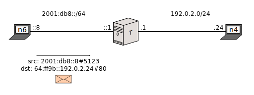
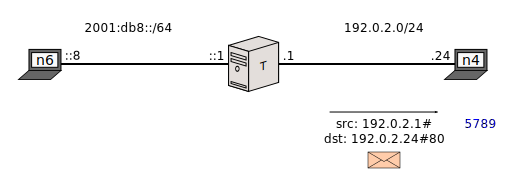
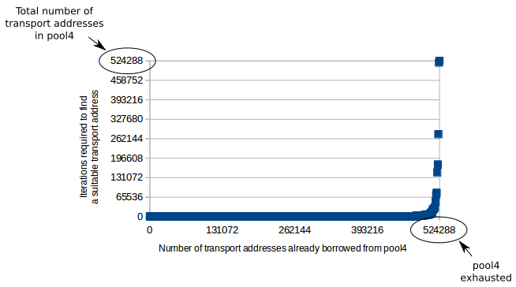
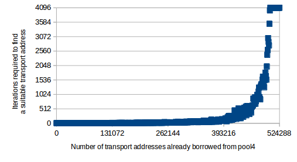

[Documentation](documentation.html) > [NAT64 in Detail](documentation.html#nat64-in-detail) > The IPv4 Transport Address Pool

# IPv4 Transport Address Pool

## Index

1. [Introduction to pool4](#introduction-to-pool4)
2. [Terminology](#terminology)
2. [Matching arguments](#matching-arguments)
3. [Mask Selection Algorithm](#mask-selection-algorithm)
	1. ["Packet attributes" argument rationale](#packet-attributes-argument-rationale)
	2. [Algorithm performance](#algorithm-performance)

## Introduction to pool4

Just like a NAPT, a Stateful NAT64 allows an indeterminate amount of clients to share a few IPv4 addresses by masking their connections using a handful of transport addresses reserved for this purpose.

In the context of NAT64, this subset of reserved address-port tuples are referred to as the "IPv4 transport address pool". You upload addresses to this pool to allow the NAT64 to mask packets (ie. replace their source address) with them.

In the context of Jool, "IPv4 transport address pool" can be shortened as "IPv4 address pool", "IPv4 pool", or, more commonly, as the name it is usually referred as in the code: "pool4". It is represented as a table that simply groups a handful of transport addresses with a few supportive attributes. Here's an example of what could be considered a populated pool4. You may choose to ignore the columns `Mark` and `Max Iterations` for the purposes of the discussion in the immediate future:

Mark | Protocol | Max Iterations | Transport Addresses
-----|----------|----------------|---------------------|
   0 | TCP      | 1024 (auto) | 192.0.2.1#5000 192.0.2.1#5001 192.0.2.1#5002 192.0.2.1#5003 ... 192.0.2.1#5999 192.0.2.1#6000 |
   0 | UDP      | 1024 (auto) | 192.0.2.1#10000 192.0.2.1#10001 192.0.2.1#10002 192.0.2.1#10003 ... 192.0.2.1#10999 192.0.2.1#11000 |
   0 | ICMP     | 1024 (auto) | 192.0.2.1#100 192.0.2.1#101 192.0.2.1#102 192.0.2.1#103 ... 192.0.2.1#199 192.0.2.1#200 |

 

>  Please note that we choose to represent transport addresses in the format "`<address>#<port>`" as opposed to the more widely adopted "`<address>:<port>`". These are otherwise no different than other transport addresses.

Given that configuration, let's pretend that the following TCP SYN packet arrives to the NAT64 _T_:

Because port 5123 is available for the TCP protocol in the table above, one way to mask the packet could be as follows:

Another technically valid option is this:

Whichever mask was chosen, it is used to create the [BIB entry](bib.html) that will reserve the transport address and serve future packets involved in this connection.

While it might make sense for the NAT64 to attempt to retain the source port while masking for the sake of simplicity, it is not always possible (ie. when the port is not listed in the table or another BIB entry has already reserved it), and even then, [recommendations exist to drive NAT64s as unpredictable as possible for security reasons]({{ site.draft-nat64-port-allocation }}). As long as the source packet matches both the Mark and the Protocol, _any of the listed transport addresses could be used to mask it_.

>  Pool4 is currently undergoing deep refactors in order to support [per-customer granularity](https://tools.ietf.org/html/draft-ietf-sunset4-nat64-port-allocation-02). Some information in this article might be obsoleted in the future.

The pool4 table can be edited on a running NAT64 Jool by means of [`--pool4`](usr-flags-pool4.html) userspace application commands.

## Terminology

- Pool4 is a table. It is composed out of "pool4 sets".
- Pool4 sets are collections of transport addresses that share [matching arguments](pool4.html#matching-arguments) (Mark and Protocol). They also have an additional field: Max Iterations.  
  You can think of sets as "rows", as this is how they are often represented in this documentation.  
- A pool4 entry is an address/port range tuple. Sets are made out of them.

## Matching arguments

`Mark` and `Protocol` are considered "matching arguments" in that, for a pool4 set to be a candidate for packet masking, these two fields need to match the packet.

Packets that do not match _both_ the mark _and_ the protocol of any pool4 sets will not be translated.

"Mark" is an integer (32-bit) field the kernel can label the packet with. [It belongs to the structure that holds the packet](http://elixir.free-electrons.com/linux/v4.13.12/source/include/linux/skbuff.h#L736) (ie. it is not some IPv4 field or otherwise written in the packet itself), so it is only meaningful until the packet leaves the kernel. It defaults to zero.

You can mark packets using the [MARK](http://www.linuxtopia.org/Linux_Firewall_iptables/x4368.html) target:

	ip6tables -t mangle -A PREROUTING --source 2001:db8::/28   -j MARK --set-mark 2
	ip6tables -t mangle -A PREROUTING --source 2001:db8::16/28 -j MARK --set-mark 3

The intent is so you can reserve different pool4 ranges for different customers. For example, with the following pool4 configuration,

Mark | Protocol | Max Iterations | Transport Addresses
-----|----------|----------------|---------------------|
   2 | TCP      | 1024 (auto) | 192.0.2.1#(1-65535) |
   3 | TCP      | 1024 (auto) | 192.0.2.2#(1-65535) |

then the entirety of the `192.0.2.1` address will mask the `2001:db8::/28` network, and the `192.0.2.2` address will mask the `2001:db8::16/28` network. (TCP only, of course.)

>  Ever since [`--instance`](usr-flags-instance.html) became a feature, `Mark` has somewhat fallen into obsolescence, as its behavior can be replicated by having several Jool instances, each with its own pool4. [`Mark` can still prove to be the better performing option, however](https://github.com/NICMx/mark-src-range).

## Mask Selection Algorithm

To choose the transport address that will mask the source address of the original packet, Jool uses [algorithm 3 of RFC 6056](https://tools.ietf.org/html/rfc6056#page-14). Here's a simplified pseudocode version of it:

	mask = F(packet attributes)
	while mask has already been reserved:
		mask = mask + 1

Simply put, a pseudorandom and valid (ie. belongs to the table) address/mask is computed by hashing [a few packet attributes](usr-flags-global.html#--f-args). (The hashing function is `F()`.) The code then keeps iterating through the available masks until it finds one that hasn't been reserved by a BIB entry.

### "Packet Attributes" Argument Rationale

The reason why the address is the result of a blend of the original packet's fields (as opposed to a complete random) is because you want connections involving the same addresses to be masked similarly for the sake of application protocols that expect so. For example, assume that you have the following pool4:

Mark | Protocol | Max Iterations | Transport Addresses
-----|----------|----------------|---------------------|
   0 | TCP      | 1024 (auto) | 192.0.2.1#(5000-6000) 192.0.2.2#(5000-6000) |

Suppose that `n6` is running a game client, and that the client opens two connections to game server `n4`. Given that individual players usually play on a single device, the server may expect both connections to be sourced from the same IPv4 address. It is therefore not in your best interests if the NAT64 masks the first connection as `192.0.2.1#5555` and the second connection as `192.0.2.2#5555`. (Which would be valid, based on the pool4 table above.)

Basing the pseudorandom from a few packet fields (eg. source IPv6 address) raises the probability that the NAT64 will pick close or adjacent masks for connections that share them.

For example, suppose that `n6`'s address is `2001:db8::8`, and that `F(2001:db8::8) = 192.0.2.1#5555`. According to the algorithm, the first connection will yield mask `192.0.2.1#5555`, and the second one will yield `192.0.2.1#5556`. (Because `5555` has already been reserved.)

### Algorithm Performance

One weakness of algorithm 3 of RFC 6056 is that its iterative phase and the fact that similar connections tend to be masked adjacently can yield expensive traversals when pool4 is large and BIB has reserved most of its transport addresses.

As an example, assume the following pool4 configuration:

Mark | Protocol | Max Iterations | Transport Addresses
-----|----------|----------------|--------------------------|
   0 | ICMP     | Infinity       | (192.0.2.0/29)#(0-65535) |

This pool has 8 IPv4 addresses (192.0.2.0 through 192.0.2.7), and each address has 65536 ports. This means that an IPv4/TCP packet will need to iterate 524288 times (and fail) when the BIB has completely exhausted pool4.

The following graph was taken from a real experiment and shows how stock mask computation tends to degrade as pool4 reaches exhaustion:

> The horizontal axis represents the number of pool4 addresses that are "taken" by some BIB/session entry.
> 
> The vertical axis can be thought as the "slowness" of the algorithm. You want this number to be as low as possible.
> 
> It is important to highlight that the horizontal axis does *not* represent time. Sessions (and therefore BIB entries) *time out* over time, which means that "Number of transport addresses already borrowed from pool4" goes up and down depending on how many simultaneous connections are being translated by the NAT64 at a time. New connections push the graph towards the right, while closing connections push it towards the left. This means that, if your pool4 size is somewhat larger than your connection population, you will remain comfortably on the left side on the graph. Meaning, the algorithm will never become slow.
> 
> Just for a bit of context, most of the connections I see while analyzing traffic are HTTP. While those are many, they are also very short-lived. Most of these connections are initiated and then closed instantly, and then they time out after [4 minutes by default](#--tcp-trans-timeout).

Through most of the run, and due to the random nature of `F()`, masks tend to be allocated uniformly across the pool4 domain and collision (which causes the algorithm to iterate) is therefore unlikely. The algorithm rarely needs to iterate more than very few times.

As pool4 reaches exhaustion, the number of collision rapidly increases until it reaches pool4's size. From this point onwards, no masks can be allocated but the algorithm keeps doing full traversals.

With this in mind, an attacker might try to overwhelm Jool by flooding traffic specifically designed to yield a large number of BIB entries.

The `Max Iterations` column is an artificial limit to the amount of times Jool will iterate before deeming the transport address infeasible to compute. This will effectively prevent the graph from spiking, at the cost of being unable to compute some BIB entries when pool4 is about to be exhausted. This is deemed an acceptable tradeoff because BIB entries cannot be created when pool4 is completely exhausted anyway, so at this level of traffic some connections are expected to be dropped in the first place.

The following graph is a result of the same experiment as the previous one, except the iteration limit has been capped at 4096: (Notice the scale of the Y axis)

>  `Max Iterations` does not prevent an attacker from exhausting pool4; it only prevents the NAT64 from hogging up the entire CPU when it's being attacked or exhausted.

If the drawbacks of `Max Iterations` to not seem reasonable to you, another way to minimize the effects of the spike would be to keep pool4 very small. If your pool4 has 16 addresses, and almost 64k ports per address, then on the peak of the graph the local v4 address computation takes almost 16 times 64k iterations per new connection. If you only had, say, 1 address, that'd be 64k iterations. And so on. Of course, this solution is hardly viable if you need to serve a large amount of v6 clients.

The solution will be somewhat more viable if you throw [Mark](#matching-arguments) into the mix. The reason for this is that pool4 entries wearing different marks are basically members of different pools (implementation-wise), so if you have this pool4, for example:
 
Mark | Protocol | Max Iterations | Transport Addresses
-----|----------|----------------|--------------------------|
0    | TCP      | 1024 (auto)    | 192.0.2.1#(1-65535)
1    | TCP      | 1024 (auto)    | 192.0.2.2#(1-65535)
2    | TCP      | 1024 (auto)    | 192.0.2.3#(1-65535)
3    | TCP      | 1024 (auto)    | 192.0.2.4#(1-65535)

Then the peak of the graph will be 65535 for any connection (as opposed to 4 times 65535). This would have the added benefit that, if one of your users is attacking you, he or she will only mess up their own pool4 and not affect everyone else.

Ironically, another solution would be to keep pool4 *as big as possible*. This is because, again, if your pool4 size is somewhat larger than your connection population, you will remain comfortably on the left side on the graph. I suppose that, if you fear an attack, you could always filter users that are opening abnormal numbers of connections.

