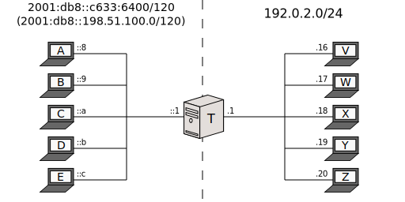
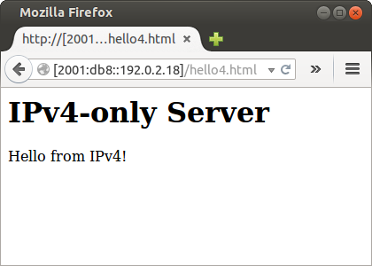
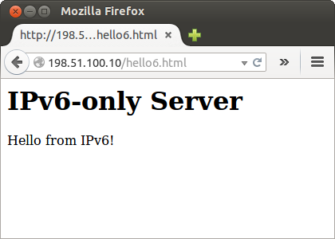

[Documentation](documentation.html) > [Basic Tutorials](documentation.html#basic-tutorials) > SIIT

# Basic SIIT Run

## Index

1. [Introduction](#introduction)
2. [Sample Network](#sample-network)
3. [Jool](#jool)
4. [Testing](#testing)
5. [Stopping Jool](#stopping-jool)
6. [Further reading](#further-reading)

## Introduction

This document explains how to run Jool in [stock SIIT mode](intro-xlat.html#siit-traditional). Follow the link for more details on what to expect.

Software-wise, only a [successful install of Jool’s kernel module](install-mod.html) is required. The userspace application is out of the scope of this document on purpose.

In case you're wondering, you can follow along these tutorials using virtual machines or alternate interface types just fine (Jool is not married to physical "_ethX_" interfaces).

## Sample Network

You don't need all the nodes shown in the diagram to follow along; you can get away with only _A_, _T_ and _V_; the rest are very similar to _A_ and _V_ and are shown for illustrative purposes only.

We will pretend I have address block 198.51.100.8/29 to distribute among my IPv6 nodes.

Jool requires _T_ to be Linux. The rest can be anything you want, as long as it implements the network protocol it's connected to. You are also free to configure the networks using any manager you want.

For the sake of simplicity however, the examples below assume every node is Linux and everything is being configured statically using the well-known `ip` command (and friends). Depending on your distro, your mileage might vary on how to get the network manager out of the way (assuming that's what you want). Just to clarify, the point of `service network-manager stop` below is to claim control over your interface addresses and routes (otherwise the `ip` commands might be ineffectual).

Also to simplify, routing will be reduced to default all unknown traffic towards _T_. Note that there is nothing martian about anyone's configuration otherwise.

This is nodes _A_ through _E_:


user@A:~# service network-manager stop
user@A:~# /sbin/ip link set eth0 up
user@A:~# # Replace ".8" depending on which node you're on.
user@A:~# /sbin/ip addr add 2001:db8::198.51.100.8/120 dev eth0
user@A:~# /sbin/ip route add default via 2001:db8::198.51.100.1


Nodes _V_ through _Z_:


user@V:~# service network-manager stop
user@V:~# /sbin/ip link set eth0 up
user@V:~# # Replace ".16" depending on which node you're on.
user@V:~# /sbin/ip addr add 192.0.2.16/24 dev eth0
user@V:~# /sbin/ip route add default via 192.0.2.1


Node _T_:


user@T:~# service network-manager stop
user@T:~# 
user@T:~# /sbin/ip link set eth0 up
user@T:~# /sbin/ip addr add 2001:db8::198.51.100.1/120 dev eth0
user@T:~# 
user@T:~# /sbin/ip link set eth1 up
user@T:~# /sbin/ip addr add 192.0.2.1/24 dev eth1


Because we haven't turned _T_ into a translator yet, nodes _A_ through _E_ still cannot interact with _V_ through _Z_, but you might want to make sure _T_ can ping everyone before continuing.

Next, enable forwarding on _T_.


user@T:~# sysctl -w net.ipv4.conf.all.forwarding=1
user@T:~# sysctl -w net.ipv6.conf.all.forwarding=1


>  These sysctls make sense conceptually, but Jool doesn't actually depend on them, currently.
> 
> What happens is, if you omit them in kernels 3.5 and below, everything will seem to work, but Linux will drop some important ICMP traffic. Skipping them in kernels 3.6 and above doesn’t actually yield known adverse consequences.
> 
> Whether this inconsistency is a bug in older or newer kernels [is a rather philosophical topic]({{ site.repository-url }}/issues/170#issuecomment-141507174). On the other hand, Jool 4.0 will almost certainly require forwarding, so you might as well start preparing your scripts.

The only caveat you need to keep in mind before inserting Jool is that you need to [get rid of receive offloads in the translating machine](offloads.html). Do that by means of `ethtool`:


user@T:~# ethtool --offload eth0 gro off
user@T:~# ethtool --offload eth0 lro off
user@T:~# ethtool --offload eth1 gro off
user@T:~# ethtool --offload eth1 lro off


(If it complains it cannot change something, keep in mind it can already be off; run `sudo ethtool --show-offload [interface]` to figure it out.)

## Jool

This is the insertion syntax:

	user@T:~# /sbin/modprobe jool_siit \
			[pool6=<IPv6 prefix>] \
			[blacklist=<IPv4 prefixes>] \
			[pool6791=<IPv4 prefixes>] \
			[disabled]

See [Kernel Module Options](modprobe-siit.html) for a description of each argument. The following suffices for our sample network:

	user@T:~# /sbin/modprobe jool_siit pool6=2001:db8::/96

That means the IPv6 representation of any IPv4 address is going to be `2001:db8::<IPv4 address>`. See below for examples.

## Testing

If something doesn't work, try the [FAQ](faq.html).

Try to ping _A_ from _V_ like this:


user@V:~$ ping 198.51.100.8
PING 198.51.100.8 (198.51.100.8) 56(84) bytes of data.
64 bytes from 198.51.100.8: icmp_seq=1 ttl=63 time=7.45 ms
64 bytes from 198.51.100.8: icmp_seq=2 ttl=63 time=1.64 ms
64 bytes from 198.51.100.8: icmp_seq=3 ttl=63 time=4.22 ms
64 bytes from 198.51.100.8: icmp_seq=4 ttl=63 time=2.32 ms
^C
--- 198.51.100.8 ping statistics ---
4 packets transmitted, 4 received, 0% packet loss, time 3006ms
rtt min/avg/max/mdev = 1.649/3.914/7.450/2.249 ms


Then ping _V_ from _A_:


user@A:~$ ping6 2001:db8::192.0.2.16
PING 2001:db8::192.0.2.16(2001:db8::c000:210) 56 data bytes
64 bytes from 2001:db8::c000:210: icmp_seq=1 ttl=63 time=3.57 ms
64 bytes from 2001:db8::c000:210: icmp_seq=2 ttl=63 time=10.5 ms
64 bytes from 2001:db8::c000:210: icmp_seq=3 ttl=63 time=1.38 ms
64 bytes from 2001:db8::c000:210: icmp_seq=4 ttl=63 time=2.63 ms
^C
--- 2001:db8::192.0.2.16 ping statistics ---
4 packets transmitted, 4 received, 0% packet loss, time 3003ms
rtt min/avg/max/mdev = 1.384/4.529/10.522/3.546 ms


How about hooking up a server in _X_ and access it from _D_:

Then maybe another one in _C_ and request from _W_:

## Stopping Jool

Revert the modprobe using the `-r` flag to shut down Jool:


user@T:~# /sbin/modprobe -r jool_siit


## Afterwords

More complex setups might require you to consider the [MTU notes](mtu.html).

Please note that none of what was done in this tutorial survives reboots! Documentation on persistence will be released in the future.

The [next tutorial](run-eam.html) covers [EAMT SIIT](intro-xlat.html#siit-with-eam). It is also recommended because it introduces usage to Jool's userspace applications.

