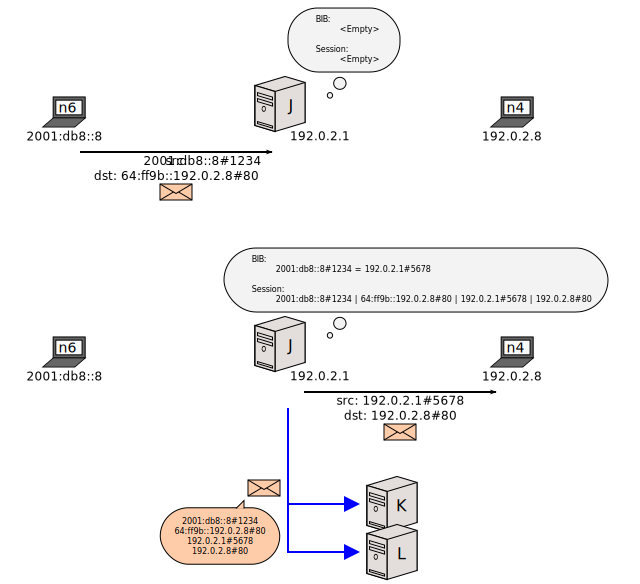
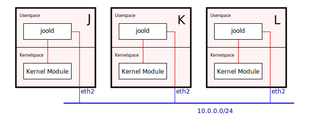

[Documentation](documentation.html) > [Other Sample Runs](documentation.html#other-sample-runs) > Session Synchronization

# Session Synchronization

## Index

1. [Introduction](#introduction)
2. [Sample Network](#sample-network)
3. [Traffic Flow Explanation](#traffic-flow-explanation)
	1. [Session Synchronization Disabled](#session-synchronization-disabled)
	2. [Session Synchronization Enabled](#session-synchronization-enabled)
4. [Architecture](#architecture)
5. [Basic Tutorial](#basic-tutorial)
	1. [Kernel Module](#kernel-module)
	2. [Daemon](#daemon)
	3. [Load Balancer](#load-balancer)
	4. [Testing](#testing)
6. [Configuration](#configuration)
	1. [`jool`](#jool)
	2. [`joold`](#joold)
7. [Persistent Daemon](#persistent-daemon)

## Introduction

The fact that stock NAT64 is stateful makes redundancy difficult. You can't simply configure two independent NAT64s and expect that one will serve as a backup for the other should the latter fall.

> Well, you can in reality, but users will notice that they need to re-establish all their lasting connections during a failure since the new NAT64 needs to recreate all the [dynamic mappings](bib.html) (and their sessions) that the old NAT64 lost.

Since version 3.5, Jool ships with a daemon that allows constant synchronization of sessions across Jool instances so you can work around this limitation. The purpose of this document is to explain and exemplify its usage.

Session Synchronization (hereby abbreviated as "SS") applies to NAT64 Jool only. SIIT stores no state, and therefore it has no difficulties regarding failover clustering.

## Sample Network

Nodes `J`, `K` and `L` will be Stateful NAT64s. Their configuration will be only slightly different, and any number of extra backup NAT64s can be appended by replicating similar configuration through additional nodes. You intend to have at least two of these.

Network `10.0.0.0/24` is a private network where the sessions will be advertised as the NAT64s serve traffic through their other interfaces. You want this network to be dedicated because sessions are confidential information to some extent, and as a result you don't want this information to leak elsewhere.

## Traffic Flow Explanation

First, let's analyze what happens when you create multiple Jool instances but do not enable SS:

### Session Synchronization Disabled

IPv6 node `n6` will interact with IPv6 node `n4` via `J`. As is natural of NAT64, and since the translation is from v6 to v4, `J` has all the information it needs to store a mapping (and a session) to service this connection:

During `n4` and `n6`'s conversation, `J` dies. `K` then drops a packet written by `n4` since it doesn't have a mask for its destination address:

And `n6` doesn't fare much better either since `K` will compute a new mask, which risks not being the same `J` chose:

The problem lies in the NAT64s not sharing their databases. Let's fix that:

### Session Synchronization Enabled

Whenever `J` translates a packet, it generates another one: A multicast through the private network, informing everyone interested of the new connection:

So when `J` dies, `K` has everything it needs to impersonate `J` and continue the conversation as uninterrupted as possible:

The reason why almost _every_ translated packet forks SS packets is because ongoing traffic tends to update sessions, and the other NAT64 instances need to also be aware of these changes.

## Architecture

Each machine hosting a NAT64 will also hold a daemon that will bridge SS traffic between the private network and its Jool instance. This daemon is named `joold`. So the kernel modules will generate SS traffic and offset the delivery task to these daemons:

Why is the daemon necessary? because kernel modules cannot open IP sockets; at least not in a reliable and scalable manner.

Synchronizing sessions is _all_ the daemon does; the traffic redirection part is delegated to other protocols (TODO I don't think this redirection thing is explained too well above). [Keepalived](http://www.keepalived.org/) is the implementation that takes care of this in the sample configuration below, but any other load balancer should also get the job done.

In this proposed/inauguratory implementation, SS traffic is distributed through an IPv4 or IPv6 unencrypted TCP connection. You might want to cast votes on the issue tracker or propose code if you favor some other solution.

It is also important to note that SS is relatively resource-intensive; its traffic is not only _extra_ traffic, but it must also do two full U-turns to userspace before reaching its destination:

It is possible to configure SS in such a manner that sessions queue themselves as much as possible before being fetched, so they can be wrapped in as few packets as possible. Of course, the price is reliability: Queued sessions will be wasted if their NAT64 dies before sending them.

There are two operation modes in which SS can be used:

1. Active/Passive: One Jool instance serves traffic at any given time, the other ones serve as backup. The load balancer redirects traffic when the current active NAT64 dies.
2. Active/Active: All Jool instances serve traffic. The load balancer distributes traffic so no NAT64 is too heavily encumbered.

Active/Active is discouraged for two reasons:

First, the Jool instances cannot ensure their session databases will be synchronized at all times before any traffic is translated; this would be prohibitely expensive. If the v4/v6 traffic is faster than the private network traffic, a race can happen:

FigFigFigFigFigFigFigFig

The endnodes will have to retry the connection.

TODO get into TCP state machine details? "There is no recovery from this situation; `J`'s session will override `K`'s session and the knowledge that a SYN packet was issued by `n4` will be lost. This drops the reliability of the TCP state machine,"

The second problem is Simultaneous Open. TODO explain

Both problems can be mitigated if the load balancer can ensure that traffic belonging to a specific connection always traverses the same NAT64. (TODO can load balancers do that? It sounds far-fetched.)

## Basic Tutorial

This is an example of the Active/Passive model. We will remove `L` from the setup since its configuration is very similar to `K`'s.

### Network

	J
	K
	n6
	n4

<!-- J -->

ip addr add 2001:db8::1/96 dev eth0
ip addr add 192.0.2.1/24 dev eth1
ip addr add 10.0.0.2/24 dev eth2

ethtool --offload eth0 gro off
ethtool --offload eth0 lro off
ethtool --offload eth1 gro off
ethtool --offload eth1 lro off
sysctl -w net.ipv4.conf.all.forwarding=1
sysctl -w net.ipv6.conf.all.forwarding=1
modprobe jool pool6=64:ff9b::/96


<!-- K -->

# X
# X
ip addr add 10.0.0.2/24 dev eth2

ethtool --offload eth0 gro off
ethtool --offload eth0 lro off
ethtool --offload eth1 gro off
ethtool --offload eth1 lro off
sysctl -w net.ipv4.conf.all.forwarding=1
sysctl -w net.ipv6.conf.all.forwarding=1
modprobe jool pool6=64:ff9b::/96


<!-- n6 -->

ip addr add 2001:db8::8/96 dev eth0
ip route add 64:ff9b::/96 via 2001:db8::1


<!-- n4 -->

ip addr add 192.0.2.8/24 dev eth0


This is generally usual boilerplate Jool mumbo jumbo. All that's special is the lack of address configuration in the backup's translating interfaces; the load balancer will take care of populating these if `J` dies.

### Kernel module

Because forking SS sessions on every translated packet is not free (performance-wise), the kernel module is not SS-enabled by default. The fact that the module and the daemon are separate binaries enhances the importance of this fact; starting the daemon is not, by itself, enough to get sessions synchronized.

	# jool --synch-enable

This asks the module to open a channel to userspace and start trading SS sessions.

### Daemon

`joold` reads the configuration of its network socket from a Json file I name `netsocket.json`. (The socket to kernelspace does not need any configuration as of now.)

	J
	K


{
	"multicast-address": "239.0.64.64",
	"multicast-port": "6464",
	"in interface": "10.0.0.1",
	"out interface": "10.0.0.1",
	"reuseaddr": 1
}



{
	"multicast-address": "239.0.64.64",
	"multicast-port": "6464",
	"in interface": "10.0.0.2",
	"out interface": "10.0.0.2",
	"reuseaddr": 1
}


A description of each field can be found [below](#netsocketjson). For now, suffice to say that the nodes will send and receive SS traffic through multicast address `239.0.64.64` on port `6464`.

Start the "daemon" in the foreground so you can see error messages (if any) easily:

	$ joold /path/to/netsocket.json

(TODO don't forget the syslog stuff)

If everything looks tidy, send the process to the background (Ctrl+Z then run `bg`):

	^Z
	$ bg

Do this in both `J` and `K`.

As far as Jool is concerned, that would be all. If `J` is translating traffic, you should see its sessions being mirrored in `K`:

	user@K:~/# jool -sn

### Load Balancer

This is not a tutorial on Keepalived, but I'll try explaining the important stuff.

Download, compile and install Keepalived:

	$ # Find the latest at http://www.keepalived.org/download.html
	$ wget www.keepalived.org/software/keepalived-X.Y.Z.tar.gz
	$ tar -xzf keepalived*
	$ cd keepalived*
	$ ./configure
	$ make
	# make install

Create `/etc/keepalived/keepalived.conf` and paste something like the following. See `man 5 keepalived.conf` for more information.

TODO missing `K`'s version of this file.

	# Keepalived will monitor this action.
	# The userspace application `jool` fails when the kernel module is not
	# responding, so we will run it every two seconds to monitor its health.
	# In reality, you might want to test more than this (such as the state
	# of the interfaces and whatnot), but for the purposes of this tutorial
	# this should be enough.
	vrrp_script check_jool {
		script "jool"
		interval 2
	}

	vrrp_instance VI_1 {
		interface eth2
		state MASTER
		# J is our main NAT64, so grant it the most priority.
		priority 500

		# This is just a random 0-255 id that must be the same for all
		# the Keepalived instances.
		virtual_router_id 64
		# Force Keepalived to use the prvate interface.
		unicast_src_ip 10.0.0.1
		# Addresses of the other peers.
		# TODO do we really need this?
		unicast_peer {
			10.0.0.2
		}

		# Reference the monitor 
		track_script {
			check_jool
		}

		# Script to run when Keepalived enters the MASTER state.
		# (ie. when this Jool becomes the active one.)
		notify_master /etc/keepalived/master.sh

		# Script to run when Keepalived enters the BACKUP state.
		# (ie. when this Jool is no longer the active one, but it's
		# still alive)
		notify_backup /etc/keepalived/backup.sh

		# Script to run when Keepalived enters the FAULT state.
		# (ie. when this Jool is not responding.)
		notify_fault  /etc/keepalived/fault.sh
	}

These are the respective referenced scripts:

	master.sh
	backup.sh
	fault.sh

<!-- Master -->

ip addr add 2001:db8::1/96 dev eth0
ip addr add 192.0.2.1/24 dev eth1


<!-- Backup -->

# --joold --advertise forces this instance to yell its entire session database
# in the network.
# We want this because the new master was likely just modprobed and therefore
# its database is empty.
jool --joold --advertise

ip addr del 2001:db8::1/96 dev eth0
ip addr del 192.0.2.1/24 dev eth1


<!-- Fault -->

ip addr del 2001:db8::1/96 dev eth0
ip addr del 192.0.2.1/24 dev eth1


Start keepalived in both `J` and `K` using `sudo keepalived -lDn`. You're done.

### Testing

Start an infinite ping from `n6` to `n4`. These packets should be translated by `J`:

	user@n6:~/$ ping6 64:ff9b::192.0.2.8

Watch the session being cascaded into `K`:

	J
	K

<!-- J -->

# jool -sin


<!-- K -->

# jool -sin


Then disable `J` somehow.

	user@J:~/# modprobe -r jool

The ping should stop and resume after a small while. This while is mostly just n4 realizing that `192.0.2.1` changed owner. Once that's done, you should notice that `K` is impersonating `J`, using the same old session that `J` left hanging:

	user@K:~/# jool -sin

(You can tell because `K` did not have to create a new session to service the ping.)

Restart `J`. The ping should pause again and, after a while, `J` should claim control again (since it has more priority than `K`):

	user@J:~/# modprobe jool pool6=64:ff9b::/96; jool --synch-enable; joold /path/to/netsocket.json

Notice that you need to initialize `J`'s NAT64 in one go; otherwise the new instance will miss `K`'s advertise.

If you forget that for some reason, you can ask `K` to advertise its sessions again manually:

	user@K:~/# jool --joold --advertise

That's all.

## Configuration

### `jool`

1. [`synch-enable`, `synch-disable`](usr-flags-global.html#synch-enable---synch-disable)
2. [`synch-flush-asap`](usr-flags-global.html#synch-flush-asap)
3. [`synch-flush-deadline`](usr-flags-global.html#synch-flush-deadline)
4. [`synch-capacity`](usr-flags-global.html#synch-capacity)
5. [`synch-max-payload`](usr-flags-global.html#synch-max-payload)

### `joold`

See the [dedicated page](config-joold.html).

## Persistent Daemon

