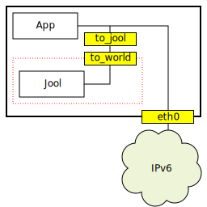
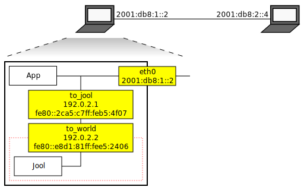

[Documentación](documentation.html) > [Otros ejemplos de uso](documentation.html#otros-ejemplos-de-uso) > Traducción local

# Traducción local

## Índice

1. [Introducción](#introduccin)
2. [Diseño](#diseo)
3. [Configuración](#configuracin)

## Introducción

A veces se desea que una máquina traduzca su propio tráfico. Esto generalmente es porque se tiene conectividad solo IPv6, una aplicación que solamente funciona en IPv4 y no se tiene un traductor cerca.

Un traductor local es una función lógica que encaja una capa SIIT o NAT64 (típicamente el primero) en algún punto entre la aplicación y la interfaz de red. La aplicación envía paquetes normalmente y el traductor los convierte antes de que alcancen el medio. Como se ha mencionado, la idea se aplica por lo general para traducir paquetes IPv4, pero no hay algo que obstaculice hacerlo a la inversa.

Este documento introduce una manera de lograr esto usando Jool.

## Diseño

La idea es encerrar a Jool en un namespace de red y enrutar paquetes necesitados de traducción hacia él.

_to_jool_ ("hacia Jool") y _to_world_ ("hacia mundo") son interfaces virtuales dual-stack interconectadas. _to_jool_ se llama así porque se usa para alcanzar a Jool; _to_world_ pertenece a un namespace de red aislado (el cuadro rojo punteado) donde Jool se encuentra traduciendo, y es tanto la puerte de entrada como de salida del tráfico de Jool.

La aplicación _App_ se liga (_bind_) a la dirección IPv4 de _to_jool_, la cual hace que sus paquetes alcancen a Jool. Jool traduce y rebota el tráfico IPv6 equivalente, que se enruta hacia _eth0_ normalmente. Si hay una respuesta, el nuevo paquete IPv6 atraviesa el camino en reversa hasta que alcanza a _App_ como un paquete de IPv4.

## Configuración

Los comandos a continuación asumen que el paquete de _App_ es `192.0.2.1 -> 203.0.113.2`, y que queremos convertirlo en `2001:db8:1::3 -> 2001:db8:2::4`.

`eth0` va a contener la dirección `2001:db8:1::2` y va a ser un proxy de `2001:db8:1::3` para el tráfico "privado" de Jool.

### 0: Predefinir eth0

	# ip -6 address add 2001:db8:1::2/32 dev eth0
	# ip -6 route add default via ...

### 1: Crear las interfaces virtuales y el namespace nuevo

	# ip netns add joolns
	# ip link add name to_jool type veth peer name to_world
	# ip link set up dev to_jool
	# ip link set dev to_world netns joolns
	# ip netns exec joolns ip link set up dev to_world

### 2: Determinar direcciones de enlace del par de direcciones virtuales

Las direcciones de enlace se usan como siguientes saltos después.

	$ ip -6 address show scope link dev to_jool
	4: to_jool: <BROADCAST,MULTICAST,UP,LOWER_UP> mtu 1500 qlen 1000
	    inet6 fe80::2ca5:c7ff:feb5:4f07/64 scope link 
	       valid_lft forever preferred_lft forever
	# ip netns exec joolns ip -6 address show scope link dev to_world
	3: to_world: <BROADCAST,MULTICAST,UP,LOWER_UP> mtu 1500 qlen 1000
	    inet6 fe80::e8d1:81ff:fee5:2406/64 scope link 
	       valid_lft forever preferred_lft forever

### 3: Preparar direcciones y ruteo en el namespace joolns

	# ip netns exec joolns ip -6 route add default via fe80::2ca5:c7ff:feb5:4f07 dev to_world
	# ip netns exec joolns ip -4 address add 192.0.2.2/24 dev to_world

### 4: Preparar direcciones y ruteo en el namespace global

	# echo 1 > /proc/sys/net/ipv6/conf/eth0/proxy_ndp
	# ip -6 neigh add proxy 2001:db8:1::3 dev eth0
	# ip -6 route add 2001:db8:1::3/128 via fe80::e8d1:81ff:fee5:2406 dev to_jool
	# ip -4 address add 192.0.2.1/24 dev to_jool
	# ip -4 route add default via 192.0.2.2 dev to_jool
	# echo 1 | tee /proc/sys/net/ipv6/conf/*/forwarding

### 5: Encender a Jool dentro de joolns

	# ip netns exec joolns modprobe jool_siit
	# ip netns exec joolns jool_siit --eamt --add 192.0.2.1   2001:db8:1::3
	# ip netns exec joolns jool_siit --eamt --add 203.0.113.2 2001:db8:2::4

### 6: Confirmar que todo funciona

	# ping -c1 203.0.113.2
	PING 203.0.113.2 (203.0.113.2) 56(84) bytes of data.
	64 bytes from 203.0.113.2: icmp_req=1 ttl=62 time=0.843 ms

	--- 203.0.113.2 ping statistics ---
	1 packets transmitted, 1 received, 0% packet loss, time 0ms
	rtt min/avg/max/mdev = 0.843/0.843/0.843/0.000 ms

Ver el [issue #177]({{ site.repository-url }}/issues/177#issuecomment-144648229) para ver la versión original propuesta de estos comandos, que aplican traducción local como un CLAT en 464XLAT.

