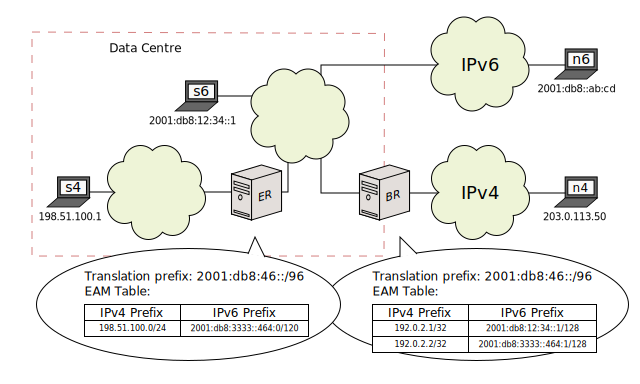
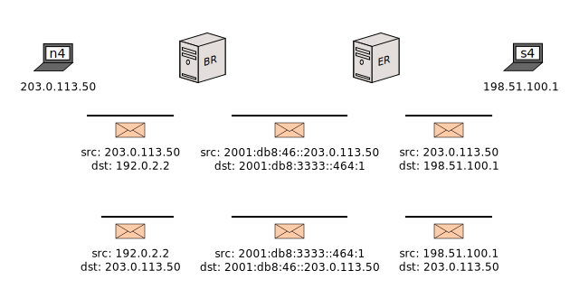

[Documentación](documentation.html) > [Arquitecturas definidas](documentation.html#arquitecturas-definidas) > SIIT-DC: Modo de traducción dual

# SIIT-DC: Modo de traducción dual

## Índice

1. [Introducción](#introduccin)
2. [Red](#red)
3. [Configuración](#configuracin)

## Introducción

Este documento es un resumen de la arquitectura _SIIT-DC: Dual Translation Mode_, y un pequeño tutorial que la construye utilizando a Jool.

SIIT-DC-DTM es una mejora opcional a [SIIT-DC](siit-dc.html) que agrega un traductor espejo para heredar los beneficios de [464XLAT](464xlat.html).

## Red

Esta es la arquitectura mostrada en la [sección 3.2 del RFC 7756]({{ site.draft-siit-dc-2xlat }}#section-3.2):

Es igual a la de SIIT-DC, excepto que una isla IPv4 aislada se ha agregado dentro del Data Centre. _ER_ va a revertir la traducción realizada por _BR_ para que estos nodos puedan aparentemente nativamente interactuar con el Internet de IPv4.

Esto es necesario si SIIT-DC no es suficiente debido a que alguna aplicación en el Data Centre no soporta NAT (i.e. la falta de transparencia de direcciones de IP) o IPv6.

Este va a ser el flujo de paquetes esperados (además de los mostrados en [SIIT-DC](siit-dc.html)):

## Configuración

Comenzar desde la [configuración de SIIT-DC](siit-dc.html#configuration) y agregar el siguiente SIIT Jool a _ER_:


modprobe jool_siit pool6=2001:db8:46::/96
jool_siit --eamt --add 198.51.100.0/24 2001:db8:3333::464:0/120


Y el nuevo registro de servidor en _BR_:


jool_siit --eamt --add 192.0.2.2 2001:db8:3333::464:1


Por supuesto, también hay que asegurar que `2001:db8:3333::464:0/120` es enrutado hacia la interfaz IPv6 de _ER_.

