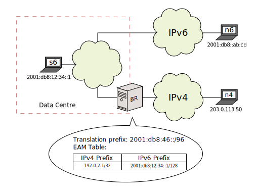

[Documentación](documentation.html) > [Arquitecturas definidas](documentation.html#arquitecturas-definidas) > SIIT-DC

# SIIT-DC

## Índice

1. [Introducción](#introduccin)
2. [Red](#red)
3. [Configuración](#configuracin)

## Introducción

Este documento es un resumen de la [arquitectura _SIIT-DC_]({{ site.draft-siit-dc }}), y un pequeño tutorial que la construye utilizando a Jool.

SIIT-DC es una mejora sobre SIIT tradicional donde la EAMT se introduce y estandariza. Con esto, el uso de direcciones IPv4 se optimiza y el embebido de direcciones IPv4 en servidores IPv6 se hace redundante.

## Red

Esta es la arquitectura mostrada en [la sección 3 del RFC 7755]({{ site.draft-siit-dc }}#section-3):

_n6_ es un cliente IPv6 cualquiera. _s6_ es uno de los servidores del Data Centre (IPv6). _n4_ es un cliente IPv4 cualquiera. _BR_ ("Border Relay") es un SIIT.

`2001:db8:46::/96` se enruta hacia la interfaz IPv6 de _BR_, y `192.0.2.1/32` similarmente se enruta hacia su interfaz IPv4. Esto se realiza mediante técnicas de enrutamiento IP convencionales.

El punto de SIIT-DC es que _n6_ puede usar el servicio IPv6 de _s6_ usando conectividad IPv6 normal, mientras que _n4_ lo usa mediante _BR_.

Este va a ser el flujo de paquetes para _n6_:

Y este va a ser el flujo esperado para _n4_:

La fuente de _n4_ se traduce a través del prefijo tradicional del [RFC 6052](https://tools.ietf.org/html/rfc6052). Esto no se limita a _n4_, por supuesto: La dirección de cualquier nodo de IPv4 va a ser traducida de esta manera. El resultado neto es que, desde la perspectiva del Data Centre, todo el Internet de IPv4 es simplemente una red llamada "`2001:db8:46::/96`".

Por otro lado, la dirección de _s6_ es traducida por la EAMT. Esto se hace para que no sea necesario codificar la dirección IPv4 dentro de la dirección IPv6 de _s6_. Esto simplifica la tarea del operador a la hora de diseñar la red.

Algunas propiedades generales de SIIT-DC son:

- Dentro del Data Centre, casi toda operación es single-stack (IPv6). Esto simplifica el mantenimiento dado que soportar un protocolo es más fácil que dos.
- El tráfico IPv6 nativo jamás se modifica.
- Escala elegantemente (La operación es 100% stateless, y se puede replicar fácilmente para redundancia).
- Puede optimizar el uso de direcciones IPv4 dentro del Data Centre (porque no impone restricciones en las direcciones IPv6 de los servidores).
- Promueve el despliegue de IPv6 (conectividad hacia clientes IPv4 se convierte en un servicio proveído por la red).
- Si se desea descartar a IPv4 en el futuro, lo único que hay que hacer es quitar a _BR_.

Se espera que el DNS funcione de la misma manera que si se estuviera manejando Dual Stack: Si un nodo solicita la dirección IPv4 de _s6_, el DNS debe regresar `192.0.2.1`. Si un nodo solicita la dirección IPv6, el DNS debe regresar `2001:db8:12:34::1`.

## Configuración

Dejando comandos de red de lado, esto es Jool en _BR_:


# modprobe jool_siit pool6=2001:db8:46::/96
# jool_siit --eamt --add 192.0.2.1 2001:db8:12:34::1


Para cada servidor que se desee publicar en IPv4, agregar una entrada EAM (como se muestra para _s6_) y registros DNS adecuados.

